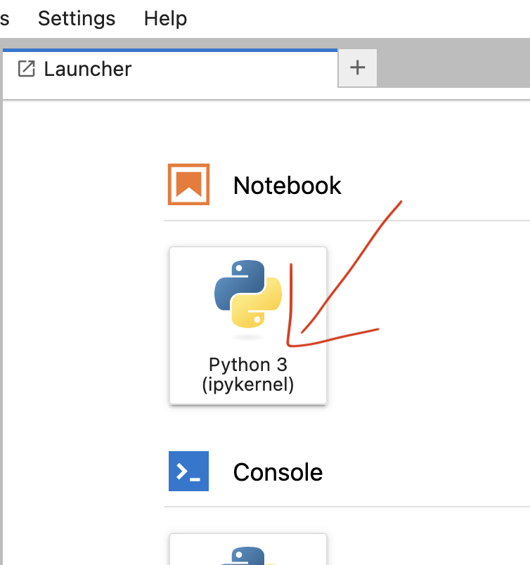
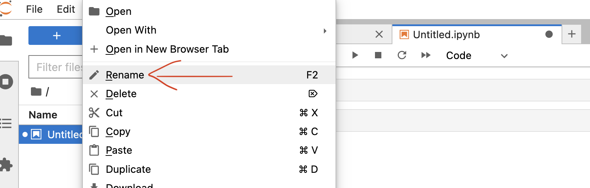
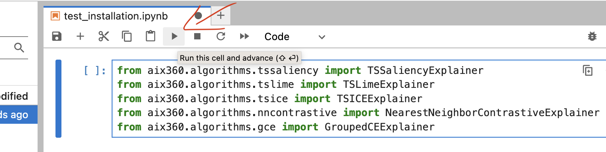

# Setup Instructions
We encourage and recommend the audience to follow the below instructions and prepare their environment prior to the tutorial.

## System Requirements

Please prepare your system to ensure that the following software requirements are met, in order to run the demo notebooks in this tutorial.

- Python 3.10
- Terminal (or relevant environment such as git bash shell, Windows Terminal etc. to execute commands throughout the tutorial).
- Internet connection (must be able to download from the internet.)

Once the requirements above are met, follow instructions in [Installation](prereq:references:installation) to prepare your python environment for this demo.

(prereq:references:installation)=
## Installation

Python packages often pose difficulties in resolving dependency conflicts or get corrupted with conflicting dependency versions. So, we strongly encourage the audience to use virtual environments for this tutorial either using Conda or Python.

(prereq:references:demo_folder)=
### Demo Folder
Create a folder to keep all demo content in an isolated place in your file system.

```bash
mkdir aix360_demo
cd aix360_demo
```

Python 3.10 is a must for this tutorial. Installing python 3.10 is beyond the scope of this tutorial. We have provided python/conda installation steps for reference. If you are interested in using Conda, you can refer to [Install Conda](prereq:references:install_conda). Otherwise, please refer to [Install Python](prereq:references:install_python).

(prereq:references:install_python)=
### Install Python
Following are few popular approaches to install python. You can use one of these approaches to install Python.

- Download and install the python binaries from [this link](https://www.python.org/downloads/release/python-31011/).
- If you need to maintain multiple python versions, use [pyenv](https://github.com/pyenv/pyenv#install-additional-python-versions).
- Use [Conda](prereq:references:install_conda).

Type the below command in Terminal to verify Python installation.
```bash
python -V
```

It must show python version as 3.10 without errors.

Now, install aix360 library using [these instructions](prereq:references:install_aix360).

(prereq:references:install_conda)=
### Install Conda

Refer to [this link](https://conda.io/projects/conda/en/latest/user-guide/install/index.html#regular-installation) to install Conda.

Now, install aix360 library using [these instructions](prereq:references:install_aix360).

(prereq:references:install_aix360)=
### Install AIX360

This section installs all the required python dependencies for this tutorial. If you are using vanilla Python (not Conda), follow the [below instructions](prereq:references:pip). If you are using conda based environments, follow [Conda](prereq:references:conda) instructions.

Note: Tensorflow 2.9.3 is not available for M1 chip users.

(prereq:references:pip)=
#### PIP
Follow the instructions [here](https://github.com/Trusted-AI/AIX360#pip-installation-of-ai-explainability-360) to install AIX360 library using pip.

Paste the below commands in Terminal and execute them sequentially.

```bash
python -m venv aix360_kdd
```

```bash
source aix360_kdd/bin/activate
```

```bash
python -m pip install xlrd huggingface-hub jupyterlab aix360[tssaliency,tsice,tslime,nncontrastive,gce]==0.3.0
```

Now, your environment is ready use aix360's time-series explainers. This tutorial uses [Jupyter Lab](https://jupyter.org/) to run and visualize the explanations. Follow [Jupyterlab](prereq:references:jupyterlab) section to start Jupyter lab.

(prereq:references:conda)=
#### Conda
Please follow the instructions [here](https://github.com/Trusted-AI/AIX360#conda) to install AIX360 library using Conda.

Paste the below commands in Terminal and execute them sequentially.

```bash
conda create --name "aix360_kdd" python=3.10 -y
conda activate aix360_kdd
```

```bash
python -m pip install xlrd huggingface-hub jupyterlab aix360[tssaliency,tsice,tslime,nncontrastive,gce]==0.3.0
```

Now, your environment is ready use aix360's time-series explainers. This tutorial uses [Jupyter Lab](https://jupyter.org/) to run and visualize the explanations. Follow [Jupyterlab](prereq:references:jupyterlab) section to start Jupyter lab.

(prereq:references:jupyterlab)=
### JupyterLab

Start jupyter lab using the below command.

```bash
jupyter lab
```

The Jupyter lab server starts at `http://localhost:8888/lab` and launches the page in a browser. If it is not launched the browser, paste and run the url in browser to start Jupyter lab server.

(prereq:references:verify_installation)=
#### Verify Installation
To verify the installation, open a new notebook from launcher. 


Right click on the new file `Untitled` from the sidebar and rename to :
```
test_installation
```



Paste the below content into a cell.

```python
import warnings
warnings.filterwarnings("ignore")

from aix360.algorithms.tssaliency import TSSaliencyExplainer
from aix360.algorithms.tslime import TSLimeExplainer
from aix360.algorithms.tsice import TSICEExplainer
from aix360.algorithms.nncontrastive import NearestNeighborContrastiveExplainer
from aix360.algorithms.gce import GroupedCEExplainer
```

Execute the cell.


Now, go to first demo use-case on [Engine Fault Detection](engine_fault_detection.md).